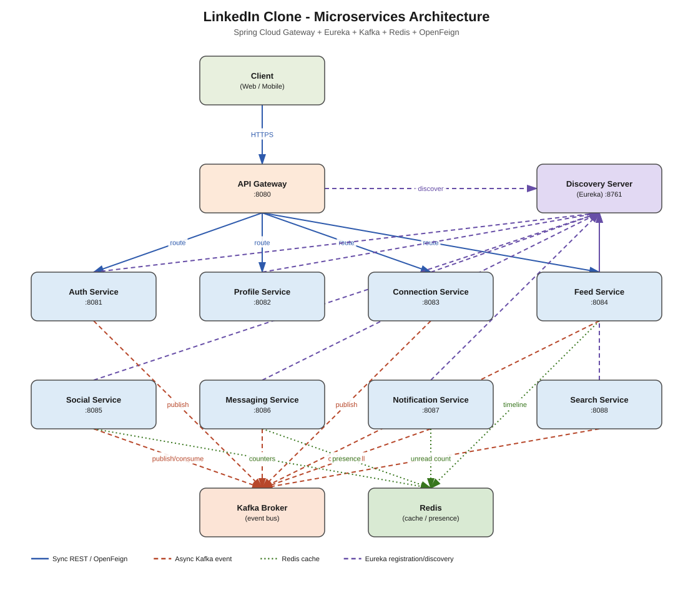

# LinkedIn Clone — Spring Boot Microservices Scaffold

This repository is a **structural scaffold**, not a finished application. It is **10
independent Spring Boot applications** — there is no parent/reactor `pom.xml` and no unified
build. Each service folder is a complete, standalone Maven project (its own
`spring-boot-starter-parent`, its own runnable `@SpringBootApplication` main class) that you
build and run **on its own**, exactly like you would any single Spring Boot app:

```bash
cd auth-service
mvn spring-boot:run
# or
mvn clean package
java -jar target/auth-service-1.0.0.jar
```

Every service has its Maven project set up, its package structure created (`controller`,
`service`, `repository`, `entity`, `dto`, etc.), its dependencies declared in `pom.xml`, a
runnable bootstrap class (`XxxApplication.java` — annotations only, e.g. `@EnableFeignClients`,
`@EnableCaching`, no business logic), and a placeholder `application.yml` — but **no business
logic has been written**. Each service's `README.md` tells you exactly what to build inside it,
in what order, and which packages each class belongs in.

> Nothing links the 10 projects together at the build level. What connects them at **runtime**
> is Eureka (service discovery), Kafka (async events) and OpenFeign (sync calls) — see the
> architecture diagram below. You could open each service in IntelliJ/VS Code as its own
> separate project, or open the repo root as a workspace of 10 unrelated Maven projects — both
> work fine, since none of them declares the others as a parent or a module.



## Why it's built this way

| Concern | Choice | Why |
|---|---|---|
| Service discovery | **Netflix Eureka** (`discovery-server`) | Services register themselves; Gateway & OpenFeign clients look up live instances instead of hardcoded URLs — enables load-balancing & horizontal scaling. |
| Single entry point | **Spring Cloud Gateway** (`api-gateway`) | Central place for routing, JWT validation, rate limiting, and circuit breaking, so business services don't repeat this logic. |
| Sync inter-service calls | **OpenFeign** | Declarative REST clients for calls that need an immediate response (e.g. Connection Service asking Profile Service "does this user exist?"). |
| Async inter-service calls | **Apache Kafka** | Decouples services for anything that doesn't need an immediate answer (e.g. "a post was liked" → Notification Service reacts later). Keeps services independently deployable and resilient to each other's downtime. |
| Caching | **Redis** | Hot-path performance: feed timelines (ZSET), like/comment counters (atomic INCR), online presence, unread notification counts, rate-limit counters. |
| Database | **PostgreSQL per service** (Elasticsearch for search) | Database-per-service pattern — each service owns its schema, no shared DB, no hidden coupling. |
| Auth | **JWT (access + refresh)**, validated at the Gateway and re-checked with method security in services | Stateless auth that scales horizontally. |

## Services

| Service | Port | Core responsibility |
|---|---|---|
| `discovery-server` | 8761 | Eureka service registry |
| `api-gateway` | 8080 | Routing, JWT filter, rate limiting, circuit breaking |
| `auth-service` | 8081 | Register/login, JWT issuance, roles |
| `profile-service` | 8082 | Profile, experience, education, skills |
| `connection-service` | 8083 | Send/accept/reject connections, "who's connected to who" graph |
| `feed-service` | 8084 | Posts + custom ranking feed algorithm (global + connection-level) |
| `social-service` | 8085 | Likes, comments, shares, bookmarks |
| `messaging-service` | 8086 | Real-time 1:1 chat (WebSocket/STOMP) |
| `notification-service` | 8087 | Event-driven notifications + real-time push |
| `search-service` | 8088 | Full-text search over people & posts (Elasticsearch) |

Each service folder contains:
```
service-name/
├── README.md                     <- what to build, entities, endpoints, events
├── docs/service-name-diagram.svg <- internal architecture diagram
├── pom.xml                       <- standalone Spring Boot pom (own spring-boot-starter-parent)
└── src/main/java/com/linkedinclone/servicename/
    ├── ServiceNameApplication.java  <- runnable main class (bootstrap only, no logic)
    ├── controller/
    ├── service/ (+ impl/)
    ├── repository/
    ├── entity/ (or document/ for Elasticsearch)
    ├── dto/
    ├── feign/          <- only in services that call other services synchronously
    ├── kafka/producer/ <- only in services that publish events
    ├── kafka/consumer/ <- only in services that consume events
    ├── security/       <- only in auth-service / api-gateway
    ├── websocket/      <- only in messaging-service / notification-service
    ├── config/
    └── exception/
```

## Suggested build order

1. **discovery-server** — bring this up first; everything else registers with it.
2. **auth-service** — nothing else is reachable without login/JWT.
3. **profile-service** — almost every other service calls this via Feign.
4. **connection-service**
5. **feed-service**
6. **social-service**
7. **messaging-service**
8. **notification-service**
9. **search-service**
10. **api-gateway** — wire this in last, once you can point it at real running services.

## Infrastructure you'll need locally (not included in this repo)

- **Kafka** (+ Zookeeper or KRaft) — event bus
- **Redis** — caching / counters / presence
- **PostgreSQL** — one logical database per service (`auth_db`, `profile_db`, `connection_db`,
  `feed_db`, `social_db`, `messaging_db`, `notification_db`)
- **Elasticsearch** — search index for `search-service`

The simplest way to spin these up is a single `docker-compose.yml` at the repo root (not
included — add your own, or ask Claude to generate one for you) with services for
`kafka`, `zookeeper`, `redis`, `postgres` (one container is fine, just create multiple
databases), and `elasticsearch`.

## Event catalog (Kafka topics)

| Topic | Producer | Consumers |
|---|---|---|
| `user.registered` | auth-service | profile-service (auto-create profile), search-service (index user), notification-service (welcome notification) |
| `user.profile.updated` | profile-service | search-service (re-index) |
| `connection.accepted` | connection-service | feed-service (update feed graph), notification-service |
| `post.created` | feed-service | social-service (init counters), search-service (index post), notification-service |
| `post.liked` / `post.commented` / `post.shared` | social-service | feed-service (ranking signal), notification-service |
| `message.sent` | messaging-service | notification-service (push if recipient offline) |

## What is intentionally *not* included

- No Java implementation classes (that's the point of a scaffold you build on)
- No `docker-compose.yml` for infra (add one to match your environment/versions)
- No CI/CD pipeline config
- No frontend

Every package folder that has nothing in it yet contains a `.gitkeep` placeholder so Git
preserves the folder structure — delete it once you add real files there.
