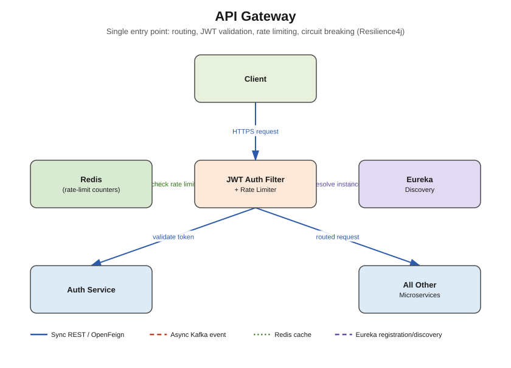

# API Gateway



## Responsibility

The single entry point for every client request. Decides **which downstream API needs to be
hit**, based on path predicates, and forwards the request to a load-balanced instance resolved
through Eureka. Also owns the cross-cutting concerns that would otherwise be duplicated in
every business service: JWT validation, rate limiting, and circuit breaking.

## Concepts used

- **Spring Cloud Gateway** (reactive, WebFlux-based) — routing engine
- **Eureka Client** — resolves `lb://SERVICE-NAME` URIs to real instances (`discovery.locator`
  is enabled so new services are auto-routable by their Eureka app-id without a route entry)
- **Redis** — backs the `RequestRateLimiter` gateway filter (token-bucket rate limiting per
  user/IP) — reactive Redis client (`spring-boot-starter-data-redis-reactive`)
- **Resilience4j** (`spring-cloud-starter-circuitbreaker-reactor-resilience4j`) — circuit
  breaker + fallback around routes to downstream services, so one slow/dead service doesn't
  cascade-fail the gateway
- **JJWT** — parses/validates the JWT signature and expiry directly in a `GlobalFilter`,
  without a network call to `auth-service` on every request (validate locally with the shared
  secret/public key; only hit `auth-service` for token *issuance* and *refresh*)

## What needs to be done

### 1. Routing (`config` package)
- Routes are already declared in `application.yml` under `spring.cloud.gateway.routes` — one
  entry per business service, matching Eureka's registered application name (`lb://AUTH-SERVICE`
  etc). Adjust path predicates as your controllers' `@RequestMapping` prefixes solidify.

### 2. `filter` package
- `JwtAuthenticationFilter implements GlobalFilter` — reads the `Authorization: Bearer <token>`
  header, validates signature + expiry, and either lets the request through (optionally
  enriching it with `X-User-Id` / `X-User-Roles` headers for downstream services to trust) or
  returns `401 Unauthorized`.
- Whitelist `/api/v1/auth/register` and `/api/v1/auth/login` as public routes (no token needed).
- `RateLimiterConfig` — define a `KeyResolver` bean (e.g. by authenticated user id, falling
  back to IP for anonymous requests) used by the built-in `RequestRateLimiter` filter.

### 3. `security` package
- `JwtValidator` / `JwtUtil` — shared logic for parsing claims, checking expiry, extracting
  roles. Keep the signing **secret in sync with `auth-service`** (same value in both
  `application.yml` files, or better, pull both from a shared secret store / Vault).

### 4. `exception` package
- Global error handler (`@Order` on a `WebExceptionHandler` or `ErrorWebExceptionHandler`) to
  return consistent JSON error bodies for 401/403/404/circuit-open/5xx responses.

## Folder structure

```
src/main/java/com/linkedinclone/apigateway/
├── config/      <- RateLimiterConfig, CORS config, route customizations
├── filter/      <- JwtAuthenticationFilter (GlobalFilter), logging filter
├── security/    <- JwtValidator/JwtUtil (token parsing shared logic)
└── exception/   <- centralized error response mapping
```

No `entity`/`repository`/`dto` packages — the Gateway is stateless and holds no domain data of
its own.
