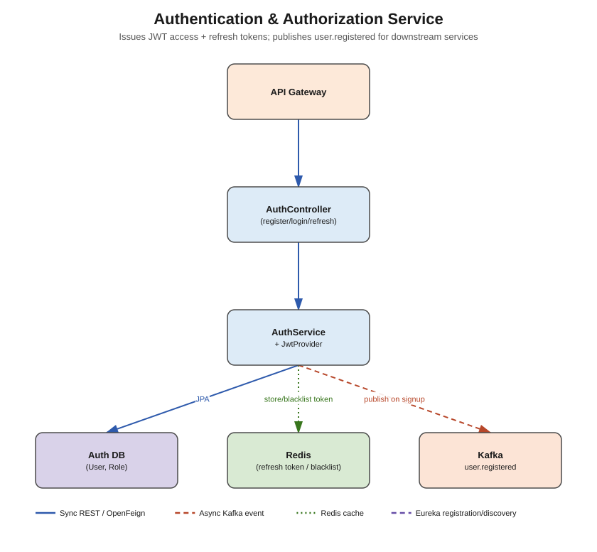

# Authentication & Authorization Service



## Responsibility

Owns identity: registration, login, JWT access/refresh token issuance, logout (token
revocation), and role-based authorization data. This is the only service that ever sees raw
passwords.

## Concepts used

- **Spring Security + JWT (JJWT library)** — stateless auth; access tokens are short-lived
  (15 min), refresh tokens longer-lived (7 days)
- **BCryptPasswordEncoder** — password hashing, never store plaintext
- **PostgreSQL + Spring Data JPA** — `auth_db`
- **Redis** — store refresh tokens (or their hash) keyed by user id with a TTL matching
  expiry, and/or an access-token **blacklist** for logout-before-expiry; also usable for
  brute-force login attempt throttling
- **Apache Kafka (producer only)** — publishes `user.registered` after a successful signup, so
  `profile-service` can auto-create an empty profile and `search-service` can index the new
  user, without auth-service needing to know either of those services exist

## Entities

- `User` — id, email, passwordHash, enabled, createdAt
- `Role` — id, name (`ROLE_USER`, `ROLE_ADMIN`) — many-to-many with `User`
- `RefreshToken` — id, token/hash, userId, expiryDate (or store this in Redis instead of
  Postgres — either is valid, Redis is simpler for TTL-based expiry)

## DTOs

- `RegisterRequest` (email, password, firstName, lastName)
- `LoginRequest` (email, password)
- `JwtResponse` (accessToken, refreshToken, tokenType, expiresIn)
- `RefreshTokenRequest` (refreshToken)
- `UserRegisteredEvent` (userId, email, firstName, lastName) — the Kafka payload

## Endpoints (`controller` package)

| Method | Path | Notes |
|---|---|---|
| POST | `/api/v1/auth/register` | public; hash password, save user, publish `user.registered` |
| POST | `/api/v1/auth/login` | public; verify credentials, issue access+refresh JWT pair |
| POST | `/api/v1/auth/refresh` | verify refresh token (against Redis/DB), issue new access token |
| POST | `/api/v1/auth/logout` | blacklist current access token / delete refresh token |
| GET | `/api/v1/auth/validate` | (optional) internal endpoint other services or the Gateway can call synchronously to double-check a token if not validating locally |

## What needs to be done

1. `entity` — `User`, `Role`, `RefreshToken` (JPA).
2. `repository` — `UserRepository`, `RoleRepository`, `RefreshTokenRepository`.
3. `dto` — request/response records listed above.
4. `security` — `JwtProvider` (generate/parse/validate tokens), `SecurityConfig`
   (`SecurityFilterChain` bean, permit `/register` & `/login`, stateless session policy),
   `CustomUserDetailsService`.
5. `service` + `service/impl` — `AuthService` (`register`, `login`, `refreshToken`, `logout`).
6. `kafka/producer` — `UserEventProducer.publishUserRegistered(...)`.
7. `controller` — `AuthController` wiring the above.
8. `exception` — `InvalidCredentialsException`, `UserAlreadyExistsException`,
   `TokenExpiredException` + a `@RestControllerAdvice` mapping them to proper HTTP codes.
9. Fill in real values in `application.yml`: `jwt.secret` (long random Base64 string — **share
   this value with `api-gateway`** if the gateway validates tokens locally), DB credentials.

## Folder structure

```
src/main/java/com/linkedinclone/authservice/
├── controller/
├── service/ (+ impl/)
├── repository/
├── entity/
├── dto/
├── security/
├── kafka/producer/
├── config/       <- SecurityConfig, RedisConfig, KafkaProducerConfig
└── exception/
```
