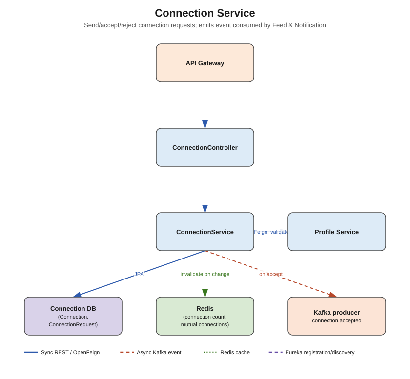

# Connection Service



## Responsibility

Owns the "who is connected to who" social graph: sending, accepting, rejecting, and removing
connection requests, plus derived data like connection count and mutual connections.

## Concepts used

- **PostgreSQL + Spring Data JPA** — `connection_db`
- **Redis** — cache `connectionCount(userId)` and `mutualConnections(userA, userB)` (expensive
  graph-ish queries), invalidate the affected users' cache entries whenever a connection is
  created/removed
- **OpenFeign** — calls `profile-service` (`GET /api/v1/profiles/{userId}/basic`) to validate
  the target user exists and to enrich connection request responses with the other person's
  name/avatar
- **Apache Kafka (producer only)** — publishes `connection.accepted` when a request is
  accepted. Consumed by `feed-service` (add an edge to the user's feed graph so the new
  connection's posts start showing up) and `notification-service` (notify both users)

## Entities

- `ConnectionRequest` — id, requesterId, receiverId, status (`PENDING`, `ACCEPTED`,
  `REJECTED`), createdAt
- `Connection` — id, userIdA, userIdB, connectedAt (a symmetric, materialized edge — created
  once a `ConnectionRequest` is accepted, makes "list my connections" a simple query instead of
  having to reason about direction)

## DTOs

- `ConnectionRequestDTO` (create request: fromUserId, toUserId)
- `ConnectionResponseDTO` (id, otherUser: BasicProfileDTO, status, createdAt)
- `ConnectionAcceptedEvent` (userIdA, userIdB, acceptedAt) — the Kafka payload

## Endpoints (`controller` package)

| Method | Path | Notes |
|---|---|---|
| POST | `/api/v1/connections/request` | send a connection request |
| PUT | `/api/v1/connections/request/{id}/accept` | accept — creates `Connection`, publishes event |
| PUT | `/api/v1/connections/request/{id}/reject` | reject |
| DELETE | `/api/v1/connections/{connectionId}` | remove an existing connection |
| GET | `/api/v1/connections/{userId}` | list a user's connections (paginated) |
| GET | `/api/v1/connections/{userId}/count` | **cached** connection count |
| GET | `/api/v1/connections/mutual?userA=&userB=` | **cached** mutual connections |

## What needs to be done

1. `entity` — `ConnectionRequest`, `Connection`.
2. `repository` — `ConnectionRequestRepository`, `ConnectionRepository` (with a query to check
   "are these two already connected" efficiently, e.g. by always storing the smaller userId
   first in `userIdA`).
3. `dto` — DTOs above.
4. `feign` — `ProfileServiceClient` (`@FeignClient(name = "PROFILE-SERVICE")`) with a method
   mirroring `GET /api/v1/profiles/{userId}/basic`.
5. `service` + `service/impl` — `ConnectionService` (request/accept/reject/remove, cached
   count/mutuals with `@Cacheable`/`@CacheEvict`).
6. `kafka/producer` — `ConnectionEventProducer.publishConnectionAccepted(...)`.
7. `controller` — `ConnectionController`.
8. `exception` — `ConnectionRequestNotFoundException`, `AlreadyConnectedException`,
   `UserNotFoundException` (translated from a Feign 404).
9. Add a **Resilience4j circuit breaker / fallback** around the Feign call to profile-service
   so a profile-service outage degrades gracefully (e.g. return the request with `otherUser =
   null` rather than failing the whole request).

## Folder structure

```
src/main/java/com/linkedinclone/connectionservice/
├── controller/
├── service/ (+ impl/)
├── repository/
├── entity/
├── dto/
├── feign/
├── kafka/producer/
├── config/       <- RedisCacheConfig, FeignConfig, KafkaProducerConfig
└── exception/
```
