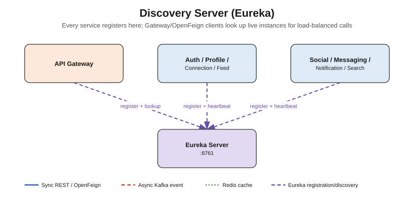

# Discovery Server (Eureka)



## Responsibility

The service registry. Every other microservice (including the API Gateway) registers itself
here on startup and sends periodic heartbeats. Anything that needs to call another service
(the Gateway's routing, or an OpenFeign client) asks Eureka for the current list of healthy
instances instead of using a hardcoded host:port — this is what makes horizontal scaling and
load-balancing possible.

## Concepts used

- **Netflix Eureka Server** (`spring-cloud-starter-netflix-eureka-server`)
- Self-registration is turned **off** for this service itself (`register-with-eureka: false`,
  `fetch-registry: false`) — it's the registry, not a client of itself.
- No database, no Kafka, no Redis — this service is purely in-memory registry state.

## What needs to be done

1. Add `@EnableEurekaServer` on the main `@SpringBootApplication` class
   (`DiscoveryServerApplication`).
2. That's it for a minimal version — `application.yml` is already configured with:
   - `server.port: 8761`
   - self-registration disabled
   - self-preservation disabled (dev convenience only — **re-enable in production**,
     otherwise Eureka will never expire stale instances during network partitions)
3. Optional hardening for later:
   - Run 2+ Eureka instances peer-aware (each registers with the other) for high availability.
   - Add Spring Security basic auth on the Eureka dashboard (`/`) if exposed outside a
     private network.

## Folder structure

```
src/main/java/com/linkedinclone/discoveryserver/
└── config/     <- (optional) security config if you lock down the Eureka dashboard
```

No `controller`, `service`, `repository`, or `entity` packages are needed here — this service
has no business logic or persistence of its own.
