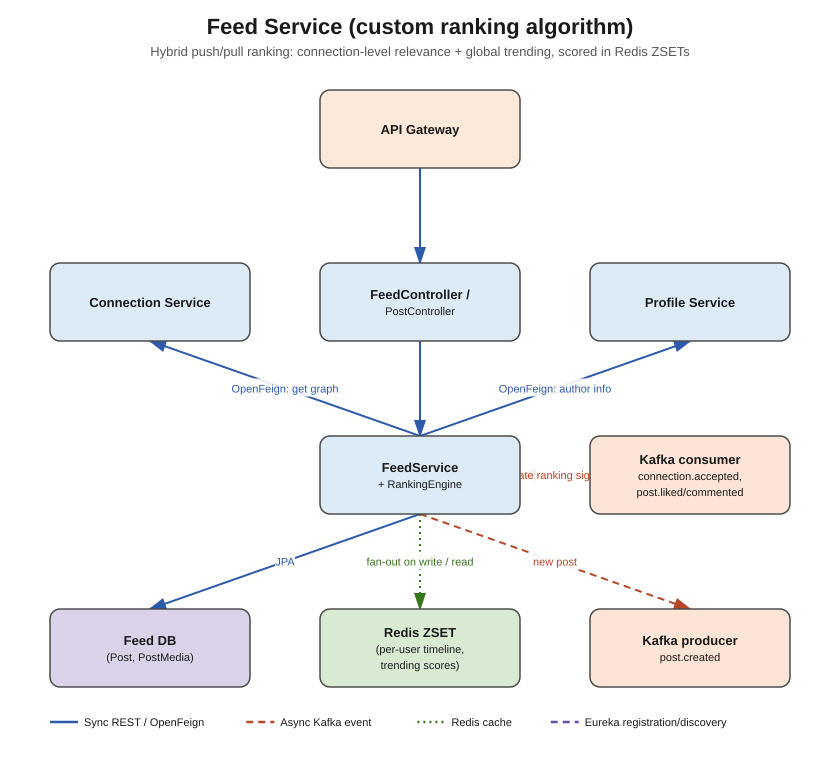

# Feed Service



## Responsibility

Owns posts themselves, and the **custom feed-ranking algorithm** that decides what shows up in
a user's home feed — a mix of connection-level content (posts from people they're connected to)
and global/trending content (high-engagement posts network-wide), similar in spirit to
LinkedIn's own feed.

## Concepts used

- **PostgreSQL + Spring Data JPA** — `feed_db` (source of truth for posts)
- **Redis Sorted Sets (ZSET)** — the actual serving layer for feeds:
  - `feed:{userId}` → ZSET of postIds scored by a combination of recency + engagement weight
    (a **fan-out-on-write** push model: when a user posts, push the postId onto every
    connection's feed ZSET)
  - `trending:global` → ZSET of postIds scored by engagement velocity (likes+comments+shares
    per hour), recomputed by a scheduled job — a **fan-out-on-read** pull model, merged into
    each user's feed response at read time so highly-active users ("celebrities") don't cause
    write amplification across millions of feeds
  - This hybrid push/pull approach is the standard answer to the "celebrity problem" in feed
    systems.
- **Apache Kafka**
  - **Producer**: publishes `post.created` whenever a new post is made (consumed by
    `social-service` to initialize like/comment counters, `search-service` to index it,
    `notification-service` for mention notifications)
  - **Consumer**: listens to `connection.accepted` (from `connection-service`, to add a new
    edge so future posts fan out to the new connection too) and `post.liked` /
    `post.commented` (from `social-service`, to bump that post's ranking score)
- **OpenFeign** — calls `connection-service` (`GET /api/v1/connections/{userId}`, to know who
  to fan out to) and `profile-service` (`GET /api/v1/profiles/{userId}/basic`, to enrich a post
  with its author's name/avatar before returning it)

## Entities

- `Post` — id, authorId, content, visibility, createdAt
- `PostMedia` — id, postId, mediaUrl, mediaType (IMAGE/VIDEO), position

## DTOs

- `CreatePostRequest` (content, mediaUrls)
- `PostDTO` (id, author: BasicProfileDTO, content, media, createdAt, likeCount, commentCount —
  the last two are read from social-service/Redis, not owned by this service)
- `FeedResponseDTO` (paginated list of `PostDTO`, cursor for next page)
- `PostCreatedEvent`, inbound `ConnectionAcceptedEvent`, `PostEngagementEvent` (Kafka payloads)

## Endpoints (`controller` package)

| Method | Path | Notes |
|---|---|---|
| POST | `/api/v1/posts` | create a post; persist, fan out to connections' Redis ZSETs, publish `post.created` |
| GET | `/api/v1/posts/{id}` | fetch a single post |
| GET | `/api/v1/feed?userId=&cursor=` | the ranked home feed — merge personal ZSET + trending ZSET |
| DELETE | `/api/v1/posts/{id}` | delete own post |

## What needs to be done

1. `entity` — `Post`, `PostMedia`.
2. `repository` — `PostRepository`.
3. `dto` — DTOs above.
4. `feign` — `ConnectionServiceClient`, `ProfileServiceClient`.
5. `service/algorithm` — `RankingEngine`/`FeedRankingService`: the actual scoring function
   (e.g. `score = w1*recency_decay + w2*log(engagement)`), fan-out logic, and the merge step
   that blends personal + trending ZSETs at read time.
6. `service` + `service/impl` — `PostService` (CRUD), `FeedService` (read the ranked feed).
7. `kafka/producer` — `PostEventProducer`.
8. `kafka/consumer` — `ConnectionEventConsumer`, `EngagementEventConsumer`.
9. `controller` — `PostController`, `FeedController`.
10. `config` — a `@Scheduled` job recomputing `trending:global` periodically (e.g. every 5 min).
11. `exception` — `PostNotFoundException`, `UnauthorizedPostActionException`.

## Folder structure

```
src/main/java/com/linkedinclone/feedservice/
├── controller/
├── service/ (+ impl/, + algorithm/)   <- algorithm/ holds the ranking logic specifically
├── repository/
├── entity/
├── dto/
├── feign/
├── kafka/producer/
├── kafka/consumer/
├── config/        <- RedisConfig, scheduling config, FeignConfig
└── exception/
```
