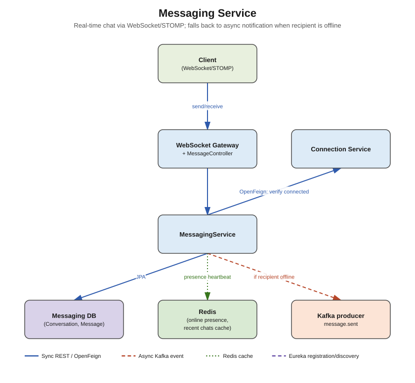

# Messaging Service



## Responsibility

Real-time 1:1 direct messaging between connected users — conversation history, message
delivery, read receipts, and online/offline presence.

## Concepts used

- **WebSocket + STOMP** (`spring-boot-starter-websocket`) — persistent bidirectional
  connection for instant message delivery, instead of polling
- **PostgreSQL + Spring Data JPA** — `messaging_db` (durable message history)
- **Redis**
  - **Presence**: `SET presence:{userId} online EX 60` refreshed by a client heartbeat — lets
    the service know instantly whether to push over the open WebSocket session or fall back to
    an async notification
  - Cache the recent conversation list per user (`GET /api/v1/messages/conversations`) since
    it's read far more often than it changes
- **Apache Kafka (producer only)** — publishes `message.sent` when the recipient is **offline**
  (no active WebSocket session), so `notification-service` can send a push/email notification;
  when the recipient is online, delivery happens directly over the WebSocket session and no
  Kafka event is needed
- **OpenFeign** — calls `connection-service` to verify sender and recipient are actually
  connected before allowing a new conversation to start (LinkedIn-style: you generally can't
  message strangers), and `profile-service` for display name/avatar

## Entities

- `Conversation` — id, userIdA, userIdB, lastMessageAt
- `Message` — id, conversationId, senderId, content, status (`SENT`, `DELIVERED`, `READ`),
  createdAt

## DTOs

- `SendMessageRequest` (conversationId or recipientUserId, content)
- `MessageDTO` (id, sender: BasicProfileDTO, content, status, createdAt)
- `ConversationDTO` (id, otherUser: BasicProfileDTO, lastMessage, unreadCount)
- `MessageSentEvent` (messageId, senderId, recipientId, preview) — Kafka payload, only
  published when recipient is offline

## Endpoints / channels

| Type | Path | Notes |
|---|---|---|
| WS | `/ws` (STOMP endpoint) | client connects here; subscribes to `/user/queue/messages` |
| STOMP SEND | `/app/chat.send` | client sends a message |
| REST GET | `/api/v1/messages/conversations` | list conversations (cached) |
| REST GET | `/api/v1/messages/conversations/{id}` | message history (paginated) |
| REST POST | `/api/v1/messages/conversations` | start a new conversation (verified via Feign) |

## What needs to be done

1. `entity` — `Conversation`, `Message`.
2. `repository` — matching repositories.
3. `dto` — DTOs above.
4. `feign` — `ConnectionServiceClient`, `ProfileServiceClient`.
5. `websocket` — `WebSocketConfig` (`@EnableWebSocketMessageBroker`, STOMP endpoint
   registration), `ChatController` (`@MessageMapping("/chat.send")`).
6. `service` + `service/impl` — `MessagingService` (persist message, check presence in Redis,
   route to WebSocket session or publish Kafka event), `PresenceService`.
7. `kafka/producer` — `MessageEventProducer` (only fires on the offline-recipient path).
8. `controller` — `ConversationController` (the plain REST parts).
9. `exception` — `NotConnectedException` (from the Feign connection check),
   `ConversationNotFoundException`.

## Folder structure

```
src/main/java/com/linkedinclone/messagingservice/
├── controller/
├── service/ (+ impl/)
├── repository/
├── entity/
├── dto/
├── feign/
├── websocket/
├── kafka/producer/
├── config/        <- WebSocketConfig, RedisConfig (presence)
└── exception/
```
