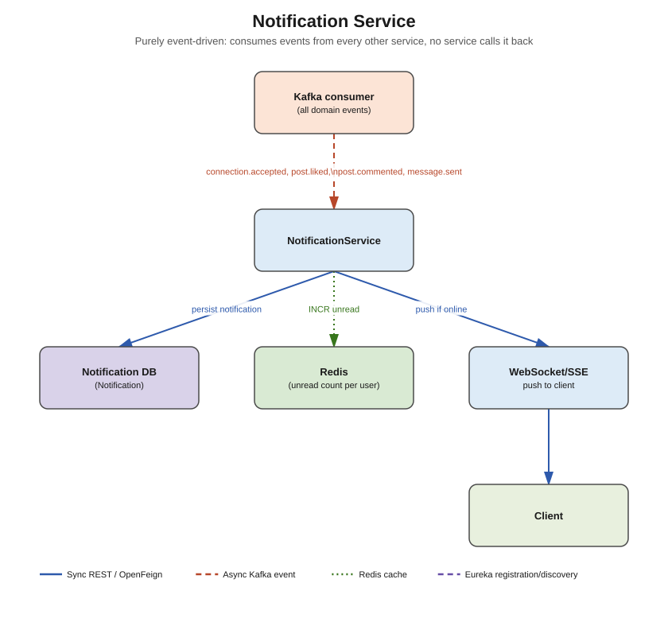

# Notification Service



## Responsibility

Aggregates events from every other service (a connection was accepted, a post was liked or
commented on, a message arrived) into a single, unified in-app notification feed, and pushes
new notifications to the client in real time. This service is **purely event-driven on the
input side** — nothing calls it synchronously, it only listens to Kafka.

## Concepts used

- **Apache Kafka (consumer only)** — this is the "sink" for nearly every event topic in the
  system:
  - `user.registered` (auth-service) → welcome notification
  - `connection.accepted` (connection-service) → "you are now connected with X"
  - `post.liked` / `post.commented` / `post.shared` (social-service) → "X liked your post"
  - `message.sent` (messaging-service, offline-recipient case only) → "new message from X"
  - Use a **separate consumer group per topic** (or one group subscribed to all topics if
    ordering across topics doesn't matter) so a slow handler for one event type doesn't block
    others
- **PostgreSQL + Spring Data JPA** — `notification_db` (durable notification history, read
  status)
- **Redis** — `INCR`/`DECR` an `unread:{userId}` counter so the notification-bell badge count
  is O(1) instead of a `COUNT(*) WHERE read = false` query on every page load
- **WebSocket / SSE** — pushes a new notification to the client instantly if they're currently
  connected (reuse the same presence signal messaging-service maintains in Redis, or maintain
  your own WebSocket session registry here)

## Design note: avoid a Feign call-back loop

Prefer **denormalizing** the actor's name/avatar into the Kafka event payload itself (e.g.
`connection-service` includes `actorName`/`actorAvatarUrl` when it publishes
`connection.accepted`) rather than notification-service calling back to `profile-service` via
Feign for every single event. This keeps notification-service simpler and avoids adding a
synchronous dependency to an otherwise fully async, event-driven service. If you do need fresh
data (e.g. avatar changed since the event was emitted), OpenFeign to `profile-service` is a
reasonable fallback — just note the added coupling.

## Entities

- `Notification` — id, userId (recipient), type (`CONNECTION_ACCEPTED`, `POST_LIKED`,
  `POST_COMMENTED`, `POST_SHARED`, `MESSAGE_RECEIVED`, `WELCOME`), actorId, actorName,
  actorAvatarUrl, entityId (postId/conversationId/etc, polymorphic reference), read (boolean),
  createdAt

## DTOs

- `NotificationDTO` (id, type, actor info, entityId, read, createdAt)
- Inbound Kafka event DTOs matching each producer's payload shape (one class per topic, or a
  generic envelope with a `type` discriminator)

## Endpoints (`controller` package)

| Method | Path | Notes |
|---|---|---|
| GET | `/api/v1/notifications?userId=` | paginated notification list |
| GET | `/api/v1/notifications/unread-count` | Redis-backed unread count |
| PUT | `/api/v1/notifications/{id}/read` | mark one as read (decrement Redis counter) |
| PUT | `/api/v1/notifications/read-all` | mark all read (reset Redis counter to 0) |

## What needs to be done

1. `entity` — `Notification`.
2. `repository` — `NotificationRepository`.
3. `dto` — DTOs above.
4. `kafka/consumer` — one listener class per topic (or grouped), each mapping its event to a
   `Notification` row + incrementing the Redis unread counter + pushing over
   WebSocket/SSE if the user is online.
5. `service` + `service/impl` — `NotificationService` (persist, mark-read, unread count).
6. `websocket` — `NotificationWebSocketConfig` / SSE emitter registry for real-time push.
7. `controller` — `NotificationController`.
8. `config` — Kafka consumer group configuration per topic.
9. `exception` — `NotificationNotFoundException`.

## Folder structure

```
src/main/java/com/linkedinclone/notificationservice/
├── controller/
├── service/ (+ impl/)
├── repository/
├── entity/
├── dto/
├── websocket/
├── kafka/consumer/
├── config/        <- KafkaConsumerConfig, RedisConfig, WebSocketConfig
└── exception/
```
