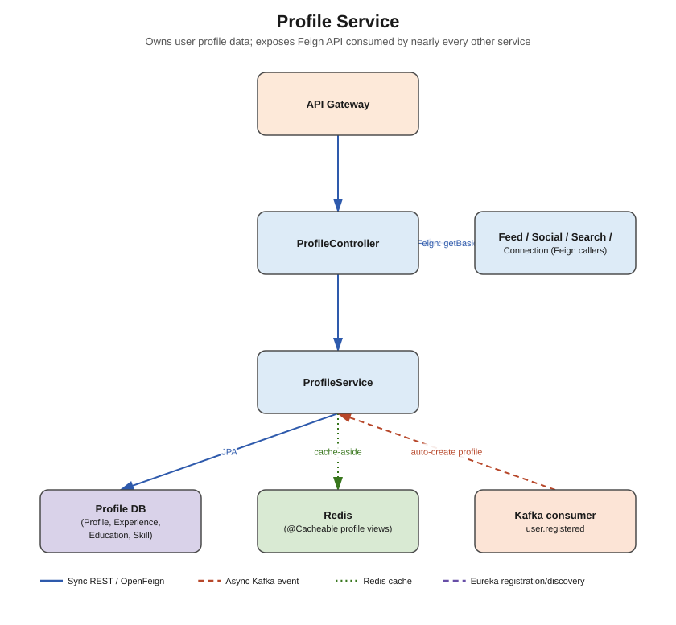

# Profile Service



## Responsibility

Owns everything about "who is this user professionally" — headline, bio, profile photo, work
experience, education, skills. This is the most-called service in the whole system: almost
every other service needs basic profile info (name, avatar, headline) to enrich its own
responses, so it exposes a lean read API meant to be hit constantly via OpenFeign.

## Concepts used

- **PostgreSQL + Spring Data JPA** — `profile_db`
- **Redis (`@Cacheable` / cache-aside)** — profile reads are far more frequent than writes;
  cache `getBasicProfile(userId)` and `getFullProfile(userId)` with a short TTL (e.g. 10 min),
  evict/update on profile edits (`@CacheEvict`)
- **Apache Kafka (consumer only)** — listens to `user.registered` from `auth-service` and
  auto-creates an empty `Profile` row so every user has one from the moment they sign up
- **OpenFeign (server side)** — this service doesn't need to *call* others much, but it is the
  primary **provider** of a Feign contract other services (`feed`, `social`, `connection`,
  `search`) declare clients against, e.g. `GET /api/v1/profiles/{userId}/basic`

## Entities

- `Profile` — userId (FK to auth's user id, not a join — services don't share DBs), headline,
  bio, location, profilePictureUrl, coverPhotoUrl
- `Experience` — id, profileId, title, company, startDate, endDate, description
- `Education` — id, profileId, school, degree, fieldOfStudy, startYear, endYear
- `Skill` — id, profileId, name, endorsementCount

## DTOs

- `ProfileDTO` (full profile, for the profile owner's own page)
- `BasicProfileDTO` (userId, fullName, headline, avatarUrl — **this is what other services
  fetch via Feign**, keep it small and cache-friendly)
- `ExperienceDTO`, `EducationDTO`, `SkillDTO`
- `UpdateProfileRequest`

## Endpoints (`controller` package)

| Method | Path | Notes |
|---|---|---|
| GET | `/api/v1/profiles/{userId}` | full profile |
| GET | `/api/v1/profiles/{userId}/basic` | **hot path** — cached, called constantly by other services |
| PUT | `/api/v1/profiles/{userId}` | update headline/bio/etc |
| POST | `/api/v1/profiles/{userId}/experience` | add experience entry |
| POST | `/api/v1/profiles/{userId}/education` | add education entry |
| POST | `/api/v1/profiles/{userId}/skills` | add a skill |

## What needs to be done

1. `entity` — `Profile`, `Experience`, `Education`, `Skill`.
2. `repository` — matching Spring Data JPA repositories.
3. `dto` — DTOs above + mappers (MapStruct or manual).
4. `service` + `service/impl` — `ProfileService`; annotate hot read methods with `@Cacheable`
   (Redis-backed `CacheManager`), writes with `@CacheEvict`/`@CachePut`.
5. `kafka/consumer` — `UserRegisteredConsumer` listening on `user.registered`, creates a blank
   `Profile` row keyed by the event's userId.
6. `feign` — this service is mostly a Feign **provider**; still add a small `feign` package if
   profile-service itself ever needs to call others (e.g. connection-service for a "connection
   count" badge on the profile page).
7. `controller` — `ProfileController`.
8. `exception` — `ProfileNotFoundException` + advice.

## Folder structure

```
src/main/java/com/linkedinclone/profileservice/
├── controller/
├── service/ (+ impl/)
├── repository/
├── entity/
├── dto/
├── feign/            <- Feign clients profile-service calls out with (if any)
├── kafka/consumer/
├── config/           <- RedisCacheConfig, KafkaConsumerConfig
└── exception/
```

> Tip: define the `BasicProfileDTO` + its Feign client interface in a small shared/contract
> location (or just duplicate the interface in each consumer service pointing at
> `PROFILE-SERVICE` via Eureka) — either approach is fine for a scaffold like this.
