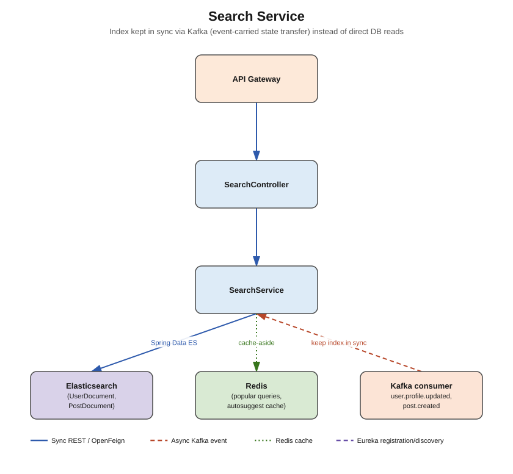

# Search Service



## Responsibility

Full-text search across people (by name, headline, skills) and posts (by content). Backed by
Elasticsearch rather than the relational databases the other services use, since full-text
relevance ranking, fuzzy matching, and autocomplete are outside what Postgres does well.

## Concepts used

- **Elasticsearch + Spring Data Elasticsearch** — `UserDocument` / `PostDocument` are
  `@Document`-annotated, not JPA `@Entity` — this service has a `document` package instead of
  `entity`
- **Apache Kafka (consumer only)** — this is the key architectural idea for search: instead of
  search-service querying other services' databases directly (tight coupling, cross-service
  joins), it keeps its own index in sync by consuming the same domain events everyone else
  does — **event-carried state transfer**:
  - `user.registered` / `user.profile.updated` (from auth-service / profile-service) → upsert
    `UserDocument`
  - `post.created` (from feed-service) → upsert `PostDocument`
  - (optionally) a `post.deleted` event to remove documents, if you add one
- **Redis** — cache popular/trending search queries and autosuggest results (short TTL), since
  search traffic is heavily skewed toward a small set of popular queries
- **OpenFeign** — generally avoided by design (see above), but acceptable as a fallback to
  `profile-service` if you need to backfill/re-index historical data that predates this
  service's Kafka consumers being turned on

## Documents (`document` package)

- `UserDocument` — userId, fullName, headline, skills (list), location
- `PostDocument` — postId, authorId, authorName, content, createdAt

## DTOs

- `SearchRequestDTO` (query, type: USERS/POSTS/ALL, page, size)
- `SearchResultDTO` (users: List<UserDocument-ish DTO>, posts: List<PostDocument-ish DTO>)

## Endpoints (`controller` package)

| Method | Path | Notes |
|---|---|---|
| GET | `/api/v1/search?q=&type=` | main search endpoint |
| GET | `/api/v1/search/autosuggest?q=` | fast prefix/fuzzy suggestions, Redis-cached |

## What needs to be done

1. `document` — `UserDocument`, `PostDocument` with `@Document(indexName = ...)` and field
   mappings (`@Field(type = FieldType.Text, analyzer = "standard")` for full-text fields).
2. `repository` — `UserSearchRepository`, `PostSearchRepository` extending
   `ElasticsearchRepository`.
3. `dto` — DTOs above.
4. `kafka/consumer` — `UserIndexConsumer` (listens to `user.registered` +
   `user.profile.updated`), `PostIndexConsumer` (listens to `post.created`).
5. `service` + `service/impl` — `SearchService` (query building, relevance sorting,
   pagination), with Redis caching around the autosuggest path.
6. `controller` — `SearchController`.
7. `config` — `ElasticsearchClientConfig`, `KafkaConsumerConfig`.
8. `exception` — generic search error handling (Elasticsearch client exceptions →
   meaningful HTTP responses).

## Folder structure

```
src/main/java/com/linkedinclone/searchservice/
├── controller/
├── service/ (+ impl/)
├── repository/
├── document/        <- @Document classes instead of entity/
├── dto/
├── feign/            <- optional backfill-only client to profile-service
├── kafka/consumer/
├── config/
└── exception/
```
