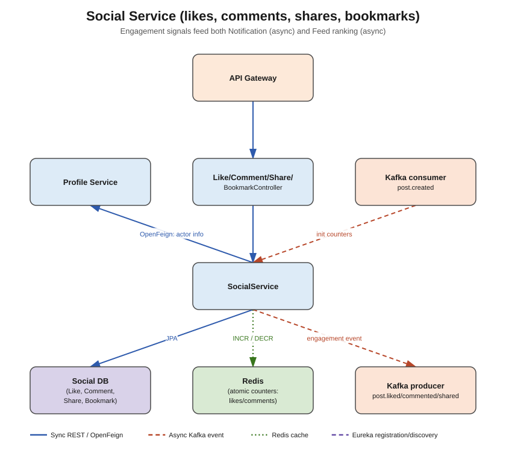

# Social Service



## Responsibility

Owns all engagement actions on a post: likes, comments, shares/reposts, and bookmarks. Kept
separate from `feed-service` so high write volume on engagement (likes especially) doesn't
compete with post creation/read traffic, and so it can scale independently.

## Concepts used

- **PostgreSQL + Spring Data JPA** — `social_db`
- **Redis atomic counters** — `INCR`/`DECR` on `likecount:{postId}` and
  `commentcount:{postId}` instead of `COUNT(*)` queries on every read; periodically (or on
  write) sync the counter back to Postgres for durability, or treat Redis as the source of
  truth for counts and Postgres as the source of truth for the actual like/comment rows
- **Apache Kafka**
  - **Producer**: publishes `post.liked`, `post.commented`, `post.shared` — consumed by
    `notification-service` (tell the post author) and `feed-service` (bump the post's ranking
    score)
  - **Consumer**: listens to `post.created` from `feed-service` to initialize the Redis
    counters for a new post at zero
- **OpenFeign** — calls `profile-service` to attach the liker's/commenter's name+avatar to
  responses

## Entities

- `Like` — id, postId, userId, createdAt (unique constraint on postId+userId)
- `Comment` — id, postId, userId, content, parentCommentId (nullable, for replies), createdAt
- `Share` — id, postId, userId, comment (optional quote-share text), createdAt
- `Bookmark` — id, postId, userId, createdAt

## DTOs

- `LikeDTO`, `CommentDTO`, `ShareDTO`, `BookmarkDTO`
- `CreateCommentRequest`, `CreateShareRequest`
- `PostEngagementEvent` (postId, actorId, type: LIKE/COMMENT/SHARE, createdAt) — Kafka payload

## Endpoints (`controller` package)

| Method | Path | Notes |
|---|---|---|
| POST | `/api/v1/social/posts/{postId}/like` | like a post (idempotent — no-op if already liked) |
| DELETE | `/api/v1/social/posts/{postId}/like` | unlike |
| POST | `/api/v1/social/posts/{postId}/comments` | add a comment |
| GET | `/api/v1/social/posts/{postId}/comments` | list comments (paginated) |
| POST | `/api/v1/social/posts/{postId}/share` | share/repost |
| POST | `/api/v1/social/posts/{postId}/bookmark` | bookmark |
| DELETE | `/api/v1/social/posts/{postId}/bookmark` | remove bookmark |
| GET | `/api/v1/social/posts/{postId}/counts` | like/comment/share counts (Redis-backed) |

## What needs to be done

1. `entity` — `Like`, `Comment`, `Share`, `Bookmark`.
2. `repository` — matching repositories; enforce the unique like constraint at the DB level.
3. `dto` — DTOs above.
4. `feign` — `ProfileServiceClient`.
5. `service` + `service/impl` — `LikeService`, `CommentService`, `ShareService`,
   `BookmarkService` (or one `SocialService` facade); wrap Redis `INCR`/`DECR` calls here.
6. `kafka/producer` — `SocialEventProducer`.
7. `kafka/consumer` — `PostCreatedConsumer` (seeds counters to zero).
8. `controller` — one controller per concern, or a combined `SocialController`.
9. `exception` — `PostNotFoundException` (from Feign 404 to feed-service if you choose to
   validate the post exists), `DuplicateLikeException`, `CommentNotFoundException`.

## Folder structure

```
src/main/java/com/linkedinclone/socialservice/
├── controller/
├── service/ (+ impl/)
├── repository/
├── entity/
├── dto/
├── feign/
├── kafka/producer/
├── kafka/consumer/
├── config/        <- RedisConfig (atomic counter helpers), KafkaConfig
└── exception/
```
